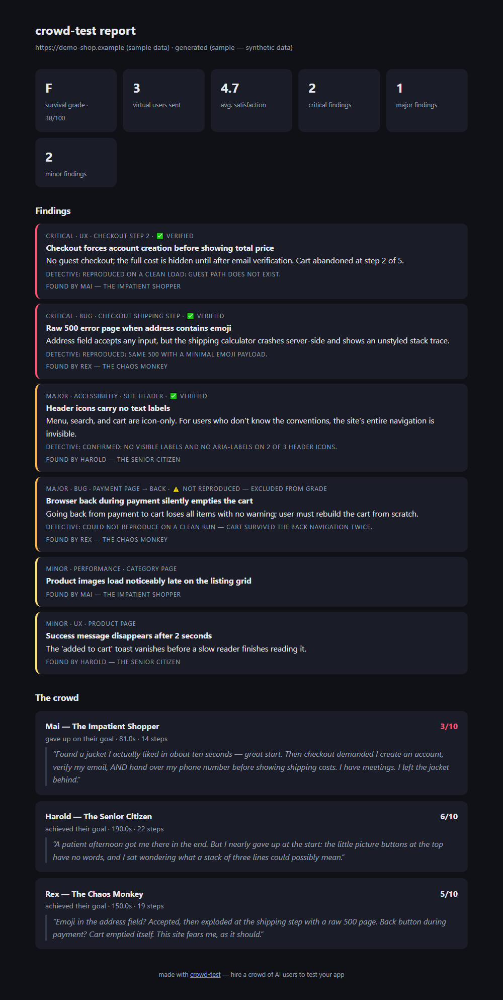
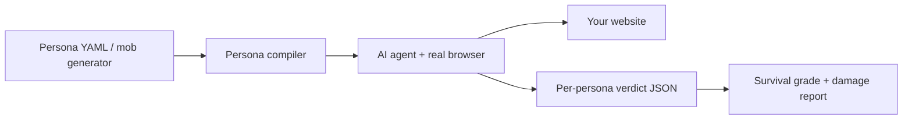

# crowd-test 🔥

**Let the mob loose on your app — before the internet does.**

The internet is not a QA lab. It's a mob: impatient, confused, distracted,
skeptical, and occasionally feral. `crowd-test` recreates that mob out of AI
personas and unleashes it on your website in real browsers. They rage-quit your
checkout, get lost in your navigation, tab through your forms, reject your
cookie banners, hunt for hidden fees, and mash your buttons looking for race
conditions.

Then they hand you the damage report — and a **survival grade**.

```
pip install crowd-test
crowd-test run https://your-app.com --mob 20
```

Does your app survive the mob? Most don't on the first run.



## Why

- **Unit tests** tell you your functions work.
- **E2E tests** tell you your happy path works.
- **crowd-test** tells you what happens when a 72-year-old, an impatient
  shopper on 4G, a privacy hawk, a keyboard-only user, and a chaos monkey all
  hit your app at once — the thing you currently learn *after* launch, from
  one-star reviews.

## The mob

Ten named ringleaders ship built-in. The rest of the mob is generated on demand.

| Persona | Who they are | What they catch |
|---|---|---|
| 🕐 **Mai — The Impatient Shopper** | 28, mobile, zero patience | Long flows, slow feedback, needless form fields |
| 👴 **Harold — The Senior Citizen** | 72, barely uses computers | Unlabeled icons, tiny text, confusing conventions |
| ⌨️ **Kai — The Keyboard-Only User** | 35, navigates without a mouse | Focus traps, missing outlines, a11y blockers |
| 👀 **Amara — The First-Time Visitor** | 31, zero context about you | Unclear value prop, buried pricing, jargon |
| 🐒 **Rex — The Chaos Monkey** | 19, breaks things for fun | Edge cases, race conditions, raw error screens |
| 🍼 **Dana — The Distracted Parent** | 38, one-handed, interrupted | Lost state, wiped forms, unforgiving flows |
| 🕵️ **Viktor — The Privacy Hawk** | 44, gives you nothing | Dark patterns, forced accounts, data grabs |
| 🌏 **Yuki — The Non-Native Speaker** | 26, literal English | Jargon, idiom buttons, US-only form formats |
| 💰 **Penny — The Bargain Hunter** | 52, audits every cent | Hidden fees, price changes, silent coupon failures |
| ⚡ **Sam — The Speedrunner** | 23, counts every click | Wasted steps, broken Enter keys, forced waits |

### Mob mode

Ten not enough? Generate as many as you can afford:

```bash
crowd-test run https://your-app.com --mob 20              # ringleaders + 20 randoms
crowd-test run https://your-app.com --personas none --mob 50 --seed 1   # pure reproducible mob
```

Every mob member gets a random age, patience level, tech skill, device, goal,
and two behavioral quirks. No two runs of your app face the same crowd —
unless you pin a `--seed` for CI.

### Roll your own ringleader

A persona is 20 lines of YAML:

```yaml
name: grandma-linh
display_name: "Linh — Skeptical Grandmother"
age: 68
tech_savviness: very_low
patience: medium
goals:
  - "Find out whether this store ships to her city"
traits:
  - "Distrusts any site that asks for personal info too early"
quirks:
  - "Reads every word of small print before clicking anything"
```

```
crowd-test run https://your-app.com --persona-file grandma-linh.yaml
```

## The survival grade

Every run ends with a verdict, computed from findings and mob satisfaction:

| Grade | Meaning |
|---|---|
| **S** | the mob couldn't lay a finger on it |
| **A** | survived with a few scratches |
| **B** | walked away limping |
| **C** | took real damage |
| **D** | barely crawled out alive |
| **F** | ☠️ the mob destroyed it |

Add `--fail-on-critical` in CI to block the merge when the mob draws blood.

## The detective 🕵️

A mob is dramatic — that's the point — but drama sometimes exaggerates. Add
`--verify` and every critical/major accusation gets handed to an independent
**detective agent**: a cold, skeptical QA engineer with no persona and no
stake, who starts from a clean page load and tries to reproduce the issue.

- ✅ **verified** — the detective reproduced it. It's real. Go fix it.
- ⚠️ **not reproduced** — stays in the report for transparency, but stops
  counting toward your survival grade.

```bash
crowd-test run https://your-app.com --mob 10 --verify
```

The mob accuses. The detective convicts. Your grade only bleeds for real bugs.

One honest caveat: the detective drives the same browser engine as the mob, so
an artifact of the automation stack itself can fool them both. Cross-engine
verification (re-checking accusations in a second, independent browser stack)
is on the roadmap. Note that crowd-test runs the browser with automation
extensions disabled so personas see your site exactly as real users do —
cookie banners and all.

## Quick start

```bash
pip install crowd-test

export ANTHROPIC_API_KEY=sk-...      # or OPENAI_API_KEY

crowd-test run https://your-app.com                  # the ten ringleaders
crowd-test run https://your-app.com --mob 10         # plus ten randoms
crowd-test run https://your-app.com --personas rex-chaos-monkey
crowd-test run https://your-app.com --goal "Sign up and create a project"
crowd-test list-personas
```

You get:

- **`report.md`** — findings ranked by severity, ready to paste into an issue or PR
  ([sample](examples/sample-report.md))
- **`report.html`** — a shareable dark-mode damage report with the survival
  grade, each persona's verdict, and their in-character complaints
- **`results.json`** — machine-readable results for your own tooling

## How it works



Each persona becomes a role-played AI agent (powered by
[browser-use](https://github.com/browser-use/browser-use)) driving a real
Chromium instance. Personas run in parallel with isolated browser profiles, so
their cookies and sessions never mix.

**Point it only at apps you own or have permission to test.** The mob is for
your own staging and production sites, not other people's.

## What it is not

- Not a load-testing or stress tool — a mob of minds, not a flood of requests.
- Not a replacement for real user research — it's the cheap, brutal layer *before* it.
- Not a scripted E2E suite — runs are exploratory and slightly different every time.
  That's the point: humans are too.

## Roadmap

- [x] Detective agent: adversarial verification of every critical/major finding (`--verify`)
- [x] Machine-readable `results.json` next to every report
- [ ] Cross-engine detective: verify accusations in a second, independent browser stack
- [ ] GitHub Action: the mob tests your preview deploy and posts the survival grade on the PR
- [ ] Screenshots attached to every finding
- [ ] Survival badge for your README (`survived the mob: A`)
- [ ] Persona marketplace: community-contributed ringleaders in `personas/`
- [ ] Grade history: track your survival grade across releases

## Contributing

The easiest and most fun contribution: **add a ringleader.** Send a PR with one
YAML file to `crowdtest/personas/` and a row in the table above. Bug reports
and feature ideas are welcome in issues.

```bash
git clone https://github.com/anhhuyn411-alt/crowd-test
cd crowd-test
pip install -e .[dev]
pytest
```

## License

[MIT](LICENSE)
