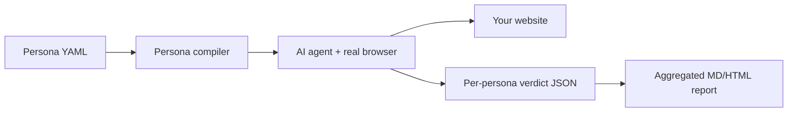

# crowd-test 🧑‍🤝‍🧑🤖

**Hire a crowd of AI virtual users to test your app — before real users do.**

`crowd-test` sends a crew of AI personas — each with their own age, patience,
tech skills, and quirks — into your website in real browsers. They actually
*use* your app the way humans do: they get confused by unlabeled icons, rage-quit
long checkouts, tab through your forms, and mash buttons to find race conditions.
Then they hand you a report.

It's a usability lab + QA team you can run from your terminal in minutes.

```
pip install crowd-test
crowd-test run https://your-app.com
```

## Why

- **Unit tests** tell you your functions work.
- **E2E tests** tell you your happy path works.
- **crowd-test** tells you what happens when a 72-year-old, an impatient
  shopper on mobile, a keyboard-only user, and a chaos monkey all hit your
  app at once — the thing you currently only learn *after* launch.

## The crowd

| Persona | Who they are | What they catch |
|---|---|---|
| 🕐 **Mai — The Impatient Shopper** | 28, mobile, zero patience | Long flows, slow feedback, needless form fields |
| 👴 **Harold — The Senior Citizen** | 72, barely uses computers | Unlabeled icons, tiny text, confusing conventions |
| ⌨️ **Kai — The Keyboard-Only User** | 35, navigates without a mouse | Focus traps, missing outlines, a11y blockers |
| 👀 **Amara — The First-Time Visitor** | 31, zero context about you | Unclear value prop, buried pricing, jargon |
| 🐒 **Rex — The Chaos Monkey** | 19, breaks things for fun | Edge cases, race conditions, raw error screens |

Each persona is just a YAML file. Write your own in 20 lines:

```yaml
name: grandma-linh
display_name: "Linh — Skeptical Grandmother"
age: 68
tech_savviness: very_low
patience: medium
goals:
  - "Find out whether this store ships to her city"
traits:
  - "Distrusts any site that asks for personal info too early"
quirks:
  - "Reads every word of small print before clicking anything"
```

```
crowd-test run https://your-app.com --persona-file grandma-linh.yaml
```

## Quick start

```bash
pip install crowd-test
playwright install chromium          # one-time browser download

export ANTHROPIC_API_KEY=sk-...      # or OPENAI_API_KEY

crowd-test run https://your-app.com                  # full crowd, 3 at a time
crowd-test run https://your-app.com --personas rex-chaos-monkey
crowd-test run https://your-app.com --goal "Sign up and create a project"
crowd-test list-personas
```

You get:

- **`report.md`** — findings ranked by severity, ready to paste into an issue or PR
- **`report.html`** — a shareable dark-mode report with each persona's verdict,
  satisfaction score, and in-character complaints

Add `--fail-on-critical` in CI to fail the build when the crowd finds a critical issue.

## How it works



Each persona becomes a role-played AI agent (powered by
[browser-use](https://github.com/browser-use/browser-use)) driving a real
Chromium instance. Personas run in parallel with isolated browser profiles, so
their cookies and sessions never mix.

## What it is not

- Not a load-testing tool — a few personas, not thousands of requests.
- Not a replacement for real user research — it's the cheap, fast layer *before* it.
- Not a scripted E2E suite — runs are exploratory and slightly different every time.
  That's the point: humans are too.

## Roadmap

- [ ] GitHub Action: the crowd tests your preview deploy and comments on the PR
- [ ] Screenshots attached to every finding
- [ ] Persona marketplace: community-contributed personas in `personas/`
- [ ] Score history: track UX score across releases

## Contributing

The easiest and most fun contribution: **add a persona.** Send a PR with one
YAML file to `crowdtest/personas/` and a row in the table above. Bug reports
and feature ideas are welcome in issues.

```bash
git clone https://github.com/anhhuyn411/crowd-test
cd crowd-test
pip install -e .[dev]
pytest
```

## License

[MIT](LICENSE)
